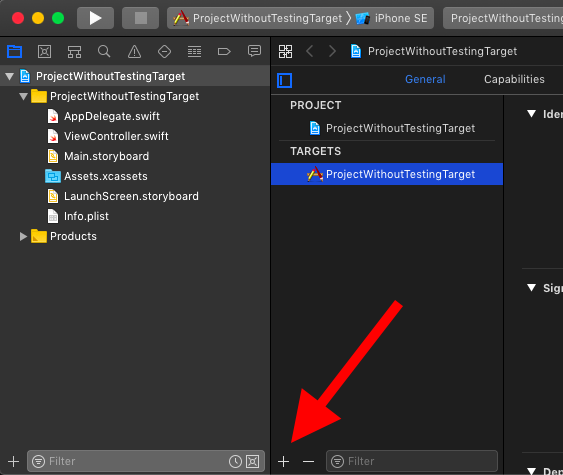

# General
 
 This website is not intended for beginners in Test-Driven Development. But if you are the kind of person who skips the text in blog posts to just read the important stuff (== the code) you might get enough information from this website to start writing valuable tests. This chapter sums up the essential information in case you are just starting with TDD.
 
## Add Test Target
 
 For the tests, you need at least one testing target in Xcode. In this target all the tests are collected. You can have more than one testing target but at the beginning one is enough.
 
 When you create a new project check the option 'Include Unit Tests' to add a testing target to your project.
 
 
 
 To add a testing target to an existing target open the targets screen in Xcode and click the plus sign at the bottom of the screen.
 
 
 
 
 
 When you add tests to the project, you need to add them to the testing target.
 
## Red-Green-Refactor
 
### Red
 
 In Test-Driven Development you always start with a failing test. This means you write the test code before you write the code to be tested. As there is no code to be tested, this test will definitely fail. A failing test is often shown by some red information. In Xcode it's a red diamond with a white x. That's why this step is called Red.
 
### Green
 
 Next you write the code that is needed to make the test pass. Usually this information is shown in combination with the color green. In Xcode this is a green diamond with a white checkmark. This step is called Green.
 
 Following these steps you have shown that the code you have written is tested by the test code. Otherwise the test would not have changed from failing (red) to passing (green). This is one value of starting with the test. If you first write the code and then the test, a green test tells you nothing. It could be that the test is always green. Only by switching from red to green you know that the test can fail.
 
### Refactor
 
 The last step in the cycle is refactoring. Now that you have the test that is testing something you can refactor the code. This step is very important. Always check the code if it can be improved. The test is there to make sure you don't break anything while improving.
 
## Test Structure
 
 Usually a test case looks like this:
 
```swift
import XCTest                   // 1
@testable import MyModule       // 2
 
class SomeTests : XCTestCase {  // 3

  var sut: SomeClass!           // 4

  override func setUpWithError() throws {       // 5
    sut = SomeClass()
  }

  override func tearDownWithError() throws {    // 6
    sut = nil
  }

  func test_name_property() {   // 7
    // The test code
  }
}
```
 
 1. Import XCTest: This is the testing framework provided by Apple
 2. Import the module (= target) you'd like to test: Using `@testable` the module is imported in a way that you can access the public and the internal properties and methods. Without this keyword you can only access the public information.
 3. The test class is a subclass of `XCTestCase`.
 4. Usually you have one 'thing' (class, struct, enum) to test per test class. This is often called `sut` which stands for system under test (see next section).
 5. The instance method `setUpWithError()` is called before each test. Usually you put there the setup code needed for each test, like setting up the instance you'd like to test.
 6. Use `tearDownWithError()` to clean up if needed. Usually you destroy the instance under test.
 7. Test methods need to start with the prefix `test`. Otherwise the test runner doesn't find the test.
 
## sut: System Under Test
 When you read test code from other developers you'll often encounter the term 'sut'. 'sut' is short for 'system under test'. This is the name usually used as the name for the instance that is tested in a test case. There are several reasons why it's a good idea to use this name in tests:
 
 1. Easier copy and paste
 2. It's obvious what is tested and what is setup to be able to test
 3. Easier to read than `loginViewController` and `networkingClient`.
 
## You Might Repeat yourself
 It's OK to not do DRY (Don't Repeat Yourself) in tests. The most important quality of a test is to be as readable and as quickly scannable as possible. This means if a test is easier to read when you copy and paste code from somewhere else, do it. Imagine you have 300k lines of code and more than 2000 tests and suddenly a test you wrote six month ago fails. You don't want to spent an hour on why the test fails. You don’t want to run the debugger to figure out what belongs to the test. Always try to write the test in a way that it is immediately clean what the test does.
 
 But this doesn't mean you should write bad code when writing tests. It's often a good idea to put code you use several times into a helper method. But keep in mind that the tests schould be readable first.
 
## Force-Unwrapping in Tests
 In good Swift code you seldom see values that are forcefully unwrapped. Each forced unwrapping is a potential crash. It's good practice to use the possibilities Swift provides to avoid potential crashes like `if let` and `guard let`.
 
 Test code is different. As mentioned above, test code has to be easy to read before everything else. That's why it's OK to use force unwrapping in test code. If the test crashes, it's just a test failure. A test failure tells you what did go wrong and what you have to do to fix it.
 
 Keep in mind that this is my opinion on this topic. There are many other opinios out there. You should try to use force-unwrapping in tests for a few days and then use `if let` and `guard let` for a few days and then figure out for youself what feels best for you.
 
## What To Test
 
 The easy and most useless answer is:
 
 > Test everything that needs to work properly.
 
 If you strictly follow the rules of Test-Driven Development you are only allowed to write production code if you have a failing test. And you have to stop writing production code as soon as all tests pass. This way, in theory you have tests for all the code you write.
 
 In practice it's not that easy. And it becomes more difficult when you write some of the tests after you have written the code to be tested. So, what should be tested?
 
 The tests should give you confidence in the code and they should make refactoring easier. If you are in doubt, ask yourself if the test you are going to write would increase you confidence in the code. And always try to write the tests in a way that they are unlikely to break during refactoring of the code.
 
## What If Something Is Really Hard To Test
 
 Sometimes, especially when you try to add tests to code you wrote a few weeks ago, it's not obvious how to write tests. Often the reason is that the different parts of the code are too tightly coupled to each other. Sometimes the class you want to test does to much.
 
 Some people say, code that is not easy to test, is bad code.
 
 So how do you transform it to testable (good) code? There is not a general answer to this question. But it won't hurt to proceed in small steps. Maybe you can add a few UI tests that help to make sure that you don't break something while you refactor the code to make it testable via unit tests. If it's not possible to use UI tests, only change parts of the code that can be verified by hand in a few minutes.
 
 An example: Let's say we have an app that shows an info box at the first start after an update of the app. To distinguish the first start of the app from all the other starts the first view controller checks the version stored in the UserDefaults. If it's the first start, the version is updates in the UserDefaults.
 
 To test this, you need to be able to control the UserDefaults in your test. This is *the* standard use case for dependency injection. But this means you need to change the code to allow to inject that dependency.
 
 The changes needed to allow injecting the dependency could break this functionality. So you need to be extra careful in checking if this feature still works after you changed the code. This could mean to delete and reinstall the app several times until you get it right. But the effort pays off. After you have changed the code, you are able to control the circumstances of the start from the test. It could even happen, that this helps further down the live cycle of the app when requirements change and you need make changes to that part of the code. First you now have tests to ensure the feature does not break. Second injecting the dependency into that part of the code makes the code easier to change.
 
## Code That Is Easy To Test
 
 The easiest thing to test are pure functions. Pure functions are functions without any side effect. For example this function is a pure function:
 
```swift
func add(a: Int, b: Int) -> Int {
  return a + b
}
```
 
 Often this results in the impression that one should only test model objects because it's easy to write pure functions when dealing with the model objects of an app.
 
 But you can and should test each and every aspect of you app. Sure, testing the behaviour of a view controller is not as straight forward as testing pure functions. But with a bit of practice you'll be able to write tests for each and every corner of you app.
 
 In general, code that's easy to test is:
 
 - focused (does only one thing)
 - can be controlled from outside (dependency injection)
 - is explicit (it's obvious what the code does; clever code isn't clever)
 - uses descriptive names
 
 But don't trust my words on this. There are many books about how to write good code. And good code is testable. :)
 
