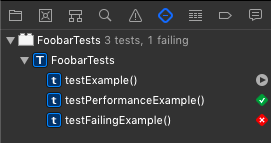

# Xcode Menu Items For Testing
 
## Test (⌘U)
 
 Runs all active tests for the currently selected scheme.

**Menu item:**  `Product > Test`

**Shortcut:**  ⌘U

## Show Test Navigator (⌘6)

The test navigator shows an overview of all test in the project.

**Menu item:**  `View > Navigator > Show Test Navigator`

**Shortcut:**  ⌘6

On the right is a symbol that shows the result of the test. If you hover over that symbol it changes to a play icon. This means if you click that icon, Xcode runs jurst this one test. The same way you can run all tests in one test case when you click at that possition next to the test case name.

## Build For Testing (⇧⌘U)

**Menu item:**  `Product > Build For > Testing`

**Shortcut:**  ⇧⌘U

## Test Without Building (⌃⌘U)

**Menu item:**  `Product > Perform Action > Test Without Building`

**Shortcut:**  ⌃⌘U

## Run Current Test (⌃⌥⌘U)

Runs the test method, in which the cursor is currently located.

**Menu item:**  `Product > Perform Action > Test`

**Shortcut:**  ⌃⌥⌘U

## Test Again (⌃⌥⌘G)

Runs the last tests that have been run.

**Menu item:**  `Product > Perform Action > Test Again`

**Shortcut:**  ⌃⌥⌘G

## Create Test Failure Breakpoint

**Menu item:**  `Debug > Breakpoints > Create Test Failure Breakpoint`
