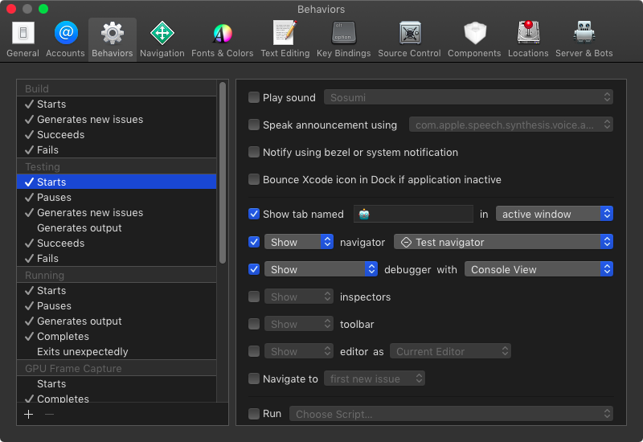
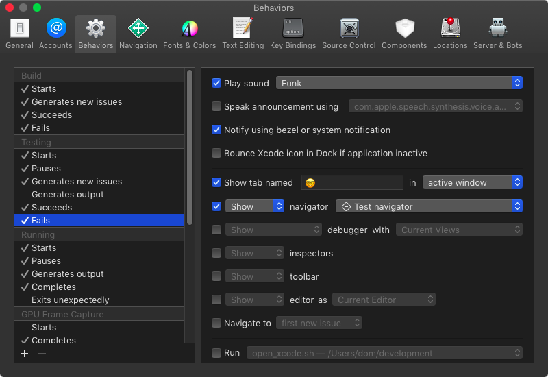

# Xcode Behaviors
 
 With behaviors you can tell Xcode what to do when things happen.
 
 
 
 On the left side you can activate various different triggers like 'Build Starts', 'Test Fails', and 'Search Completes with result'.
 
 The behaviors are roughly devided in three parts.
 
 1. Attention (like 'Play sound')
 1. Navigation (like 'Show tab named')
 1. Run a script
 
 As inspiration, here is the behavior I set up for when the test fails:
 
 
 
 Play a sound 'Funk'
 : Often compiling and running the tests takes to long to keep watching and waiting. So most of the times I do something different in that time like grap three balls and do some juggling or read again the ticket I'm working on. So I need to be notified when the test finishes. This behavior does exalty that. I have different sounds for succeeding and failing tests.
 
 Notify using bezel or system notification
 : Same as above. I like to have a visual notification when the tests are finished and what the result is.
 
 Show tab named 🤓
 : The tab with the 'name' 🤓 is my programming tab. In TDD a failing test means I need to write code to make the test pass. So I switch to the programming tab.
 
 Show test navigator
 : When the test fails I'd like to see an overview over all tests to see which tests failed.
