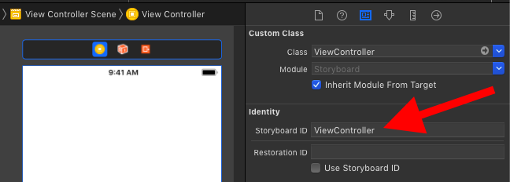

# Storyboard ID

Test whether a scene has set a Storyboard id

## Step 1: Test
 
```swift
class StoryboardTests: XCTestCase {
  
  var sut: ViewController!
  
  override func setUpWithError() throws {
    let storyboard = UIStoryboard(name: "Main", bundle: nil)
    sut = (storyboard.instantiateViewController(withIdentifier: "ViewController") as! ViewController)
  }
  
  override func tearDownWithError() throws {
    sut = nil
  }
  
  func test_viewController_hasIdentifier() {
    // given
    let storyboard = UIStoryboard(name: "Main", bundle: nil)
    
    // when
    let viewController = storyboard.instantiateViewController(withIdentifier: "ViewController")
    
    // then
    XCTAssertNotNil(viewController)
    XCTAssertTrue(viewController is ViewController)
}
```

## Step 2: Example Storyboard that makes the test pass


