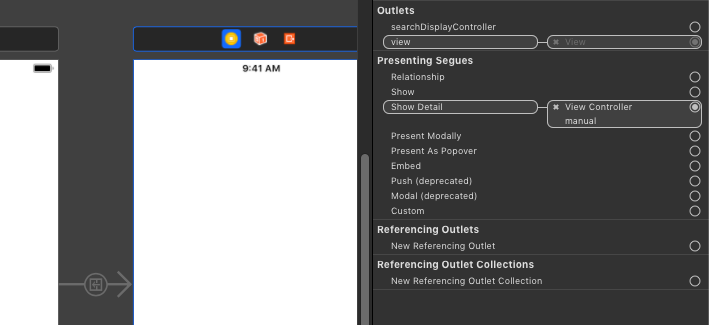

# Segue

Test whether a segue navigates to a new view contoller

## Step 1: Test
 
```swift
class StoryboardTests: XCTestCase {
  
  var sut: ViewController!
  
  override func setUpWithError() throws {
    let storyboard = UIStoryboard(name: "Main", bundle: nil)
    sut = (storyboard.instantiateViewController(withIdentifier: "ViewController") as! ViewController)
  }
  
  override func tearDownWithError() throws {
    sut = nil
  }
  
  func test_viewController_hasSegue() {
    // given
    let frame = CGRect(x: 0, y: 0, width: 300, height: 300)
    let window = UIWindow(frame: frame)
    window.rootViewController = sut
    window.makeKeyAndVisible()
    
    // when
    sut.performSegue(withIdentifier: "showDetail", sender: nil)
    
    // then
    XCTAssertTrue(sut.presentedViewController is DetailViewController)
  }
}
```
 
## Step 2: Example Storyboard that makes the test pass


